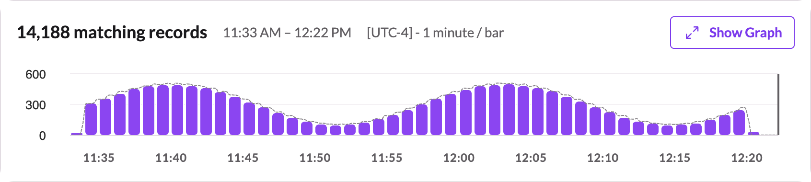
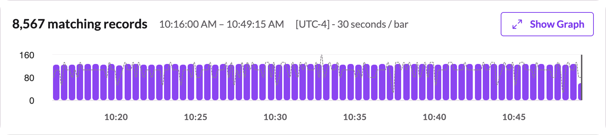

# EventGen: Simulated HTTP/HTTPS Log Generator

This module provides a Python-based event generator for simulating realistic HTTP/HTTPS web traffic logs, including both legitimate and malicious request patterns.

## Quick Start

1. **Clone the Repository**

```bash
git clone https://github.com/gcastill0/project-01-extrahop.git
cd project-01-extrahop/eventgen
```

2. **Configuration**

Create a `config.json` file in the `eventgen/` directory:

```json
{
  "webhook_url": "https://your.webhook.receiver/endpoint",
  "output_size": "5MB",
  "time_range": "1h"
}
```

- `webhook_url`: Destination to POST the event data.
- `output_size`: Total amount of data to generate (e.g., `"10MB"`, `"500KB"`, `"10GB"`).
- `time_range`: Time range to spread events across (e.g., `"10m"`, `"1h"`, `"24h"`).

Set your SDL securely as an environment variable:

```bash
export AUTH_TOKEN="0abc1dAeB2CfghDiEFj5klmG_JKnopq6Hr7sIMNOtPv8=="
```

3. **Run the Generator**

From the `eventgen/` directory, run:

```bash
python eventgen.py
```

**Expected output**

This is what you should see when running:

```bash
python3 eventgen.py 
[✓] External DNS resolution: your.webhook.receiver → 58.148.127.88
[✓] TLS handshake succeeded with your.webhook.receiver
[✓] HTTP request succeeded with status 405
257 events out of 14,189 -- 1.81 % in 1 minute(s).
512 events out of 14,189 -- 3.61 % in 2 minute(s).
769 events out of 14,189 -- 5.42 % in 3 minute(s).
1,027 events out of 14,189 -- 7.24 % in 4 minute(s).
1,285 events out of 14,189 -- 9.06 % in 5 minute(s).
1,541 events out of 14,189 -- 10.86 % in 6 minute(s).

[...]

14,189 events out of 14,189 -- 100.00 % in 59 minute(s).
```

4. **Wave vs. Linear**

At the moment the generator defaults to a wave distribution pattern. In this mode, we extropolate event distribution across the configured time period reflecting two periods of a Sine wave.



You may defer to an even distribution pattern by using the linear function instead. In that mode, the events are evenly distributed across the configured time period.



To alter this behaviour, update the function call in the main method. [See lines 314–325 of eventgen.py](https://github.com/gcastill0/project-01-extrahop/blob/main/eventgen/eventgen.py#L314-L324)


```python
def main():
    config = load_config()

    if not preflight_check(
        url = config["webhook_url"], 
        auth_token = config["auth_token"]
    ):
        print("❌ Network conditions are not suitable. Exiting.")
        exit(1)
        
    # generate_events_linear(config)
    generate_events_wave(config)
```
---

## Features

- Simulates realistic web application traffic (GET, POST, PUT, DELETE, etc.)
- Generates structured log entries in JSON format
- Injects randomized malicious traffic patterns to test detection capabilities
- Supports log export to file for replay or SIEM ingestion

### Sample Output

Each log entry includes:

- Timestamps
- Protocol (HTTP/HTTPS)
- Client and server IPs
- URI and method
- Response status
- Round-trip time
- Headers
- User identifiers
- User-agent
- Malicious payloads (optional)

### Example Entry

```json
{
  "protocol": "HTTP",
  "time": 1724879342.692399,
  "client": {"ipaddr": "192.168.1.1"},
  "server": {"ipaddr": "203.0.113.10"},
  "method": "GET",
  "uri": "/api/data",
  "status_code": 200,
  "round_trip_time": 150,
  "request_header": {
    "Host": "example.com",
    "Accept": "application/json",
    "User-Agent": "Mozilla/5.0"
  },
  "response_header": {
    "Content-Type": "application/json",
    "Content-Length": "1234"
  },
  "user_agent": "Mozilla/5.0",
  "response_content_type": "application/json",
  "user": "alice"
}
```
### Malicious Patterns

The malicious log entries are based on common attack patterns. Each record includes realistic fields like client, server, uri, method, status_code, and headers—targeting paths such as /admin, /wp-login.php, or exploits like ?cmd=rm -rf / or XSS.

 - Attack Type: Classifies the nature of the exploit (useful for tagging, alerting, or filtering).
 - Risk Level: Indicates the relative impact if the attack is successful.
 - URI Pattern: Can be used for detection rules or input sanitization guidance.

| URI Pattern                         | Description                                                                 | Attack Type             | Risk Level | MITRE Tactic         | MITRE Technique (ID)          |
|-------------------------------------|-----------------------------------------------------------------------------|--------------------------|------------|-----------------------|-------------------------------|
| `/admin`                            | Probing for unsecured admin portal.                                         | Unauthorized Access      | High       | Initial Access        | [T1190 - Exploit Public-Facing Application](https://attack.mitre.org/techniques/T1190/) |
| `/wp-login.php`                     | Attempt to access WordPress login page—common brute-force target.          | Brute Force              | High       | Credential Access     | [T1110.001 - Password Guessing](https://attack.mitre.org/techniques/T1110/001/)        |
| `/api/user?id=1 OR 1=1`            | SQL injection attempting to bypass authentication or extract data.         | SQL Injection            | Critical   | Credential Access     | [T1078 - Valid Accounts](https://attack.mitre.org/techniques/T1078/)                  |
| `/index.php?page=../../etc/passwd` | Path traversal trying to read system password file on Unix systems.        | Directory Traversal      | High       | Discovery             | [T1083 - File and Directory Discovery](https://attack.mitre.org/techniques/T1083/)     |
| `/api/search?q=<script>alert(1)</script>` | XSS injection testing client-side script execution.                 | Cross-Site Scripting     | Medium     | Collection            | [T1056.001 - Input Capture via Web](https://attack.mitre.org/techniques/T1056/001/)    |
| `/cgi-bin/test.cgi?cmd=rm -rf /`   | Command injection attempting destructive server command.                   | Remote Code Execution    | Critical   | Execution / Impact    | [T1059 - Command and Scripting Interpreter](https://attack.mitre.org/techniques/T1059/) |
| `/?id=1;DROP TABLE users`          | SQL injection that tries to delete a database table.                       | SQL Injection            | Critical   | Impact                | [T1485 - Data Destruction](https://attack.mitre.org/techniques/T1485/)                 |
| `/phpmyadmin`                      | Scanning for phpMyAdmin—a known admin portal with vulnerabilities.         | Reconnaissance           | Medium     | Reconnaissance        | [T1595.002 - Active Scanning](https://attack.mitre.org/techniques/T1595/002/)          |
| `/api/data?user=admin'--`          | SQL injection using comment to ignore password clause.                     | SQL Injection            | High       | Credential Access     | [T1078 - Valid Accounts](https://attack.mitre.org/techniques/T1078/)                  |
| `/etc/shadow`                      | Attempt to access sensitive system file directly (Linux-based systems).    | Unauthorized File Access | High       | Discovery             | [T1083 - File and Directory Discovery](https://attack.mitre.org/techniques/T1083/)     |
